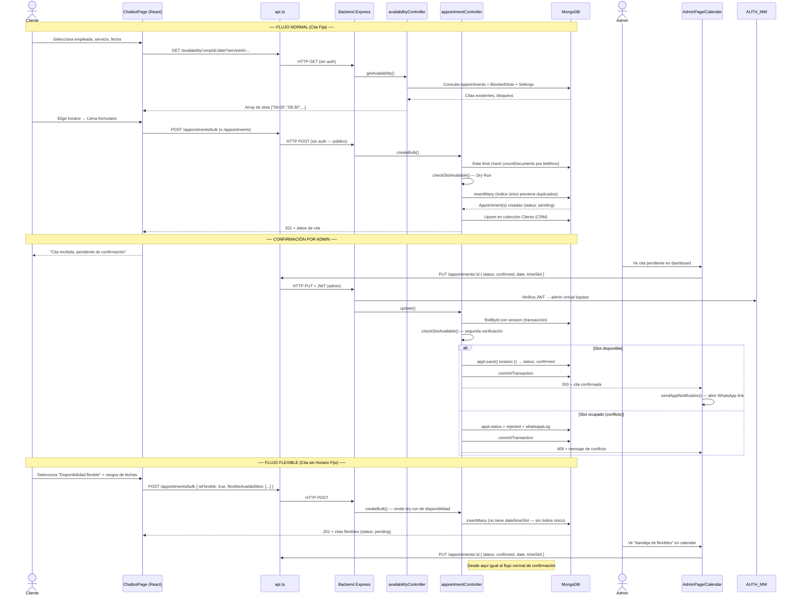

# 🔍 Auditoría Integral — L'Élixir Salon Web App
> **Fecha:** 2026-04-10 | **Auditor:** Arquitecto de Software Principal / Experto en Seguridad
> **Alcance:** Backend (Node.js/Express/MongoDB) + Frontend (React 18/TypeScript) | Full-Stack

---

## FASE 1 — Auditoría de Flujos y Seguridad

### ✅ Diagnóstico General

El sistema está bien construido para su escala. La arquitectura de seguridad es sólida: CORS estricto, Helmet, sanitización NoSQL, rate limiting por capas y JWT con `tokenVersion`. Los flujos de cita tienen varias capas de defensa. A continuación se documentan los **5 hallazgos críticos o advertencias** encontrados tras análisis exhaustivo.

---

### 🔴 HALLAZGO 1 — Race Condition Crítica en `createBulk` (TOCTOU Attack)
**Severidad: ALTA | Archivo: `server/controllers/appointmentController.js` (líneas 206–274)**

**Problema:** El endpoint `POST /api/appointments/bulk` implementa un patrón de "dry-run" (validar → insertar). Entre el paso 1 (verificar disponibilidad de cada slot con `checkSlotAvailable`) y el paso 2 (`Appointment.insertMany`), existe una ventana de tiempo durante la cual otro cliente puede reservar el mismo slot. Si dos clientes envían simultáneamente el mismo bulk, ambos pasan el dry-run y uno de los dos falla en el `insertMany` con error 11000 (unique index). El error SÍ se maneja (`catch error.code === 11000`), pero el mensaje de error no es específico sobre qué servicio colisionó.

El flujo **individual** (`POST /api/appointments`) usa exactamente el mismo patrón pero con `Appointment.create()` en lugar de `insertMany`. La ventana TOCTOU existe en ambos.

**Protección existente:** El índice parcial único `{ employee, date, timeSlot }` con `partialFilterExpression` (status no cancelado/rechazado, isFlexible != true) actúa como última línea de defensa y bloquea la doble inserción a nivel de base de datos. Esto convierte el race condition en un error recuperable, **no en corrupción de datos**.

**Impacto real:** El usuario ve un error vago ("ocurrió un error"). Los datos permanecen consistentes.

**Parche recomendado:**
```javascript
// En createBulk — reemplazar insertMany sin sesión por una transacción atómica:
const session = await mongoose.startSession();
session.startTransaction();
try {
  // Re-verificar disponibilidad DENTRO de la transacción con .session(session)
  for (const item of preparedData) {
    await checkSlotAvailable(item.employee, item.service, item.date, item.timeSlot, null, session);
  }
  const created = await Appointment.insertMany(preparedData, { session });
  await session.commitTransaction();
  // ... resto del flujo
} catch(err) {
  await session.abortTransaction();
  // manejo específico
}
```

---

### 🟡 HALLAZGO 2 — `cancel` No Usa Transacción de MongoDB (Double-Cancel Risk)
**Severidad: MEDIA | Archivo: `server/controllers/appointmentController.js` (líneas 568–604)**

**Problema:** La función `cancel` usa un patrón read → check → save sin transacción:
```javascript
const appt = await Appointment.findById(req.params.id)  // READ
// ... validations ...
appt.status = 'cancelled'
await appt.save()  // WRITE
```
Si dos peticiones simultáneas de cancelación llegan para la misma cita (ej. cliente doble-clic + admin cancelando al mismo tiempo), ambas leerán `status !== 'cancelled'`, ambas pasarán la validación, y ambas intentarán guardar. El resultado final es correcto (cita cancelada), pero el check `if (appt.status === 'cancelled') return 400` se vuelve inútil en este contexto concurrente.

**Parche recomendado:** Usar `findOneAndUpdate` atómico:
```javascript
const appt = await Appointment.findOneAndUpdate(
  { _id: req.params.id, status: { $nin: ['cancelled', 'completed'] } },
  { $set: { status: 'cancelled' } },
  { new: true }
);
if (!appt) return res.status(400).json({ success: false, message: 'No se puede cancelar esta cita.' });
```
Esto es atómico por naturaleza en MongoDB (operación de escritura única).

---

### 🟡 HALLAZGO 3 — Fuga de Información en Respuesta de Error de `reschedule`
**Severidad: MEDIA | Archivo: `server/controllers/appointmentController.js` (líneas 754–820)**

**Problema:** El endpoint `PATCH /api/appointments/:id/reschedule` no valida explícitamente que el `employeeId` recibido en el body sea un ObjectId válido antes de pasarlo a `checkSlotAvailable`. Si se pasa un valor arbitrario (ej. una cadena de texto), `checkSlotAvailable` puede lanzar un `CastError` de Mongoose que, en entorno de desarrollo, expone la ruta interna del esquema en el mensaje de error devuelto al cliente.

Adicionalmente, la ruta `/api/appointments/:id/reschedule` solo aplica `checkPermission('citas')` sin `requireRole('admin')`, lo que significa que **una empleada con permiso de `citas` puede reagendar citas de otras empleadas** cambiando el `employeeId` en el body.

**Parche recomendado:**
```javascript
// Al inicio de reschedule():
if (!mongoose.Types.ObjectId.isValid(employeeId)) {
  return res.status(400).json({ success: false, message: 'ID de especialista inválido.' });
}
// Y en la ruta, agregar requireRole('admin'):
router.patch('/:id/reschedule', authMiddleware, requireRole('admin'), apptCtrl.reschedule)
```

---

### 🟠 HALLAZGO 4 — `ProtectedRoute` con Fallback Permisivo (Security Degradation)
**Severidad: MEDIA-ALTA | Archivo: `client/src/components/ProtectedRoute.tsx` (líneas 73–88)**

**Problema:** Cuando `getMe()` falla (servidor caído, red lenta, token expirado pero con error de red), el `ProtectedRoute` entra en este bloque:
```typescript
if (cachedUser) {
  console.warn('getMe() falló, usando fallback local:', errMsg)
  setIsAuthenticated(true)
  setHasPermission(true)  // ⚠️ Esto borra la validación de permisos
}
```
El `setHasPermission(true)` **ignorará el `requiredPermission`** del route. Por ejemplo, una empleada sin permiso de `configuracion` que tenga datos cacheados en `localStorage` podría acceder temporalmente a `/admin/configuracion` si el servidor falla. El backend siempre bloqueará las acciones reales, pero la UI queda expuesta.

**Parche recomendado:**
```typescript
// En el bloque catch del fallback local:
const cachedUser = JSON.parse(localStorage.getItem('adminUser') || '{}');
const isAdmin = cachedUser.role === 'admin';
const userPerms = cachedUser.permissions || {};
const fallbackPermission = !requiredPermission || isAdmin || userPerms[requiredPermission] === true;
setHasPermission(fallbackPermission); // Respetar permisos del cache
setIsAuthenticated(true);
```

---

### 🟡 HALLAZGO 5 — `settlementController.create` No Valida Propiedad de las Citas
**Severidad: MEDIA | Archivo: `server/controllers/settlementController.js` (líneas 41–67)**

**Problema:** El endpoint `POST /api/settlements` acepta un array de `appointmentIds` en el body y los marca como `settled: true` sin verificar que:
1. Las citas realmente pertenezcan al `specialistId` enviado.
2. Las citas estén en estado `completed`.

Un usuario con permiso `liquidaciones` podría enviar manualmente en el body IDs de citas de otro especialista y liquidarlas incorrectamente, o liquidar citas que aún están `pending`.

**Parche recomendado:**
```javascript
// Validar antes de crear el Settlement:
const validAppts = await Appointment.find({
  _id: { $in: appointmentIds },
  employee: specialistId, // 🔒 Solo del especialista
  status: 'completed',    // 🔒 Solo completadas
  settled: false          // 🔒 No reliquidar
});
if (validAppts.length !== appointmentIds.length) {
  return res.status(400).json({ success: false, message: 'Algunas citas no son válidas para liquidar.' });
}
```

---

### 📊 Resumen de Hallazgos

| # | Componente | Tipo | Severidad | Estado Datos |
|---|---|---|---|---|
| 1 | `createBulk` | Race Condition (TOCTOU) | 🔴 Alta | Seguro (DB unique index) |
| 2 | `cancel` | Race Condition (Double-Cancel) | 🟡 Media | Seguro (resultado final correcto) |
| 3 | `reschedule` | Auth bypass + Info leak | 🟡 Media | Potencialmente inseguro |
| 4 | `ProtectedRoute` | Security Degradation (UI) | 🟠 Media-Alta | UI permisiva; backend seguro |
| 5 | `settlementController` | Falta validación de ownership | 🟡 Media | Posible liquidación cruzada |

---
---

## FASE 2 — Diagramas de Arquitectura (Mermaid.js)

### Diagrama 1: Arquitectura General del Sistema

```mermaid
graph TB
    subgraph CLIENT ["🖥️ Cliente (React 18 + TypeScript)"]
        LP[LandingPage / Públicas]
        CB[ChatbotPage - Agendamiento]
        ADMIN[Admin Panel - 10+ Páginas]
        PR[ProtectedRoute - Auth Guard]
        API_SVC["api.ts - Servicio HTTP Centralizado"]
    end

    subgraph INTERNET ["🌐 Internet"]
        CORS{CORS Filter}
    end

    subgraph SERVER ["⚙️ Backend (Node.js + Express)"]
        RL[Rate Limiter - express-rate-limit]
        HLM[Helmet - Security Headers]
        SAN[Sanitize - NoSQL Injection]
        AUTH_MW[authMiddleware - JWT]
        PERM_MW[checkPermission - RBAC]
        ROLE_MW[requireRole - Role Check]

        subgraph ROUTES ["📡 Rutas"]
            R_APT[/api/appointments]
            R_EMP[/api/employees]
            R_SVC[/api/services]
            R_AUTH[/api/auth]
            R_SETTLE[/api/settlements]
            R_CFG[/api/config]
            R_AVAIL[/api/availability - PÚBLICA]
        end

        subgraph CTRL ["🎮 Controladores"]
            C_APT[appointmentController]
            C_AVAIL[availabilityController]
            C_AUTH[authController]
            C_SETTLE[settlementController]
        end
    end

    subgraph DB ["🗄️ MongoDB Atlas"]
        M_APT[(Appointments)]
        M_EMP[(Employees)]
        M_SVC[(Services)]
        M_BLK[(BlockedSlots)]
        M_CFG[(SiteConfig)]
        M_SET[(Settings - Singleton)]
        M_CLI[(Clients - CRM)]
        M_SETTLE[(Settlements)]
    end

    subgraph EXTERNAL ["🔗 Servicios Externos"]
        WA[WhatsApp API - Notificaciones]
        CLOUD[Cloudinary - Imágenes]
    end

    CB -->|fetch + JWT| API_SVC
    ADMIN -->|fetch + JWT| API_SVC
    LP -->|fetch sin JWT| API_SVC
    API_SVC -->|HTTP Requests| CORS
    CORS --> RL --> HLM --> SAN
    SAN --> AUTH_MW --> PERM_MW
    PERM_MW --> ROUTES
    ROUTES --> CTRL
    C_APT --> M_APT & M_SVC & M_EMP & M_CLI
    C_AVAIL --> M_APT & M_BLK & M_EMP & M_SVC & M_SET & M_CFG
    C_AUTH --> M_EMP
    C_SETTLE --> M_SETTLE & M_APT & M_EMP
    M_APT -.->|whatsappLog pendiente| WA
    M_EMP -.->|foto URL| CLOUD
    PR -->|valida JWT local + getMe()| ADMIN
```

---

### Diagrama 2: Flujo de Reservas (User Journey Completo)



---

### Diagrama 3: Seguridad RBAC — Login y Control de Acceso

```mermaid
flowchart TD
    START([Usuario accede a ruta admin]) --> HAS_TOKEN{¿Tiene token\nen localStorage?}
    
    HAS_TOKEN -->|No| LOGIN[/admin/login]
    HAS_TOKEN -->|Sí| DECODE[Decodificar JWT localmente]
    DECODE --> EXPIRED{¿Expirado?}
    EXPIRED -->|Sí| CLEAR[Limpiar localStorage] --> LOGIN
    EXPIRED -->|No| CACHE{¿userData en cache?}
    
    CACHE -->|Sí| CHECK_LOCAL[Verificar permiso en cache\nsetIsAuthenticated] 
    CACHE -->|No| GET_ME[GET /api/auth/me]
    CHECK_LOCAL --> GET_ME

    GET_ME --> SERVER_VERIFY{Respuesta\ndel servidor}
    SERVER_VERIFY -->|401 sin cache| CLEAR
    SERVER_VERIFY -->|Error + con cache| FALLBACK[Usar datos cached\n⚠️ Hallazgo 4]
    SERVER_VERIFY -->|200 OK| UPDATE_CACHE[Actualizar localStorage\ncon permisos frescos]
    UPDATE_CACHE --> PERM_CHECK{¿requiredPermission\nen la ruta?}
    PERM_CHECK -->|No| RENDER[🟢 Renderizar página]
    PERM_CHECK -->|Sí| IS_ADMIN{¿role === admin?}
    IS_ADMIN -->|Sí → bypass| RENDER
    IS_ADMIN -->|No → empleada| HAS_PERM{permissions\nsolicitud === true?}
    HAS_PERM -->|Sí| RENDER
    HAS_PERM -->|No| REDIRECT_DASH[Redirigir /admin\ndashboard]

    subgraph BACKEND ["Backend — Middleware Chain (por Request)"]
        REQ([Request HTTP]) --> MW_AUTH[authMiddleware\nVerifica JWT secret]
        MW_AUTH --> IS_VIRTUAL{decoded.type\n=== virtual?}
        IS_VIRTUAL -->|Sí → admin| SET_VIRTUAL[req.user = virtual-admin\npermisos: bypass total]
        IS_VIRTUAL -->|No → empleada| LOAD_EMP[findById → carga permissions\nVerifica tokenVersion]
        LOAD_EMP --> TOKEN_VER{tokenVersion\nconcuerda?}
        TOKEN_VER -->|No| RESP_401[401 Sesión invalidada]
        TOKEN_VER -->|Sí| SET_EMP[req.user = { id, role, permissions }]
        SET_VIRTUAL --> MW_PERM[checkPermission ou requireRole]
        SET_EMP --> MW_PERM
        MW_PERM --> HANDLER[Controller Handler]
    end

    subgraph LOGIN_FLOW ["Flujo de Login"]
        LG_START([POST /api/auth/login]) --> ROLE_Q{role en body?}
        ROLE_Q -->|admin| CMP_ENV[Comparar con\nADMIN_USERNAME\nADMIN_PASSWORD .env]
        CMP_ENV --> VALID_ADMIN{Match?}
        VALID_ADMIN -->|Sí| SIGN_VIRTUAL["signToken('admin','admin',0,'virtual')"]
        VALID_ADMIN -->|No| RESP_401_LOGIN[401]
        ROLE_Q -->|empleada| FIND_EMP[Employee.findOne\nbcrypt.compare]
        FIND_EMP --> SIGN_EMP[signToken\nemployee._id, tokenVersion]
    end
```

---
---

## FASE 3 — Contexto Maestro para Agentes IA (AI_CONTEXT.md)

> El contenido completo del archivo `AI_CONTEXT.md` se ha escrito directamente en el proyecto. Ver sección siguiente.
